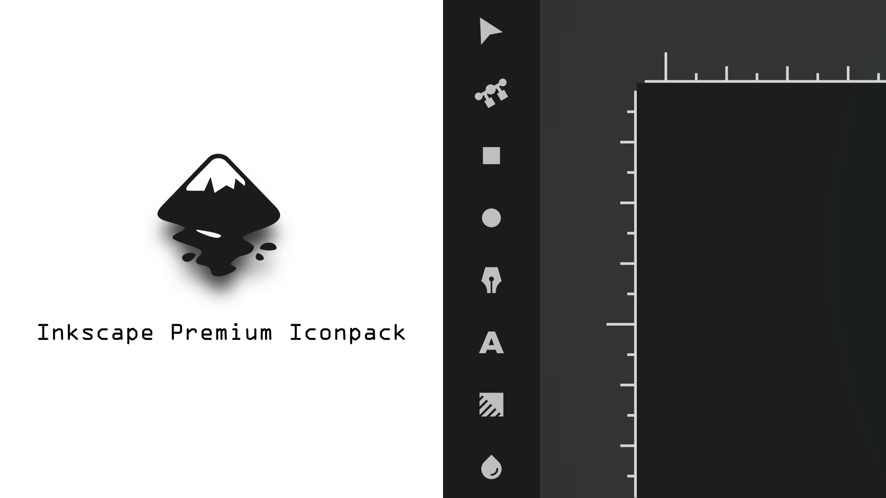
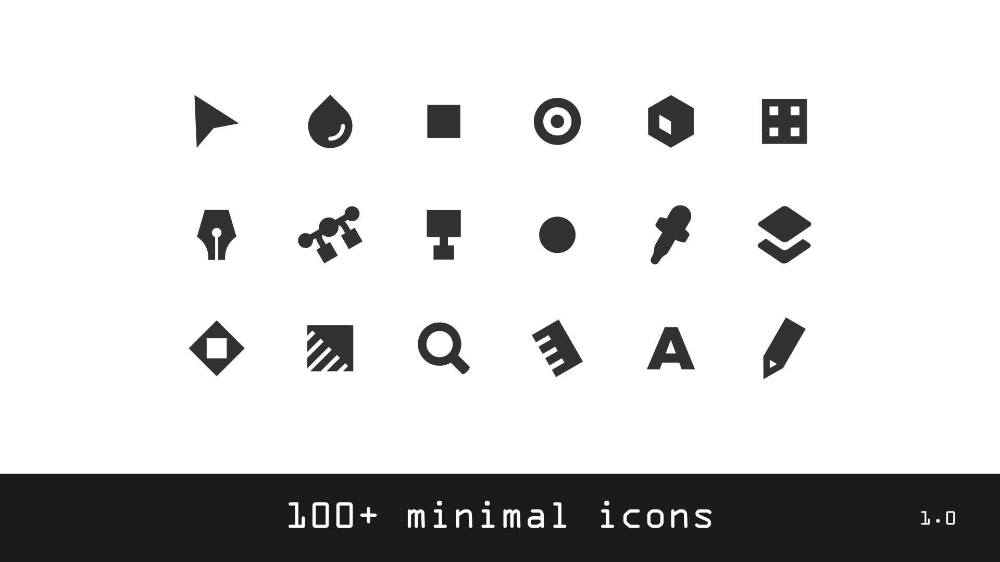

# Inkscape Iconpack

**STEPS TO INSTALL**

- extract the zip file\
- copy the folder\
- paste it in \Program Files\Inkscape\share\icons
- open inkscape\
- go to edit > preferences > interface > themeing\
- change the default icon theme to 'premium minimal icons'

 

**VERSION RELEASE**

